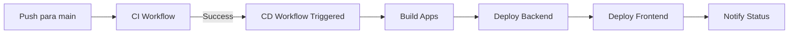

# CD Pipeline Setup - Railway Deployment

Este documento descreve o setup necessário para o workflow de CD (Continuous Deployment) para o ambiente Staging no Railway.

## Workflow Criado

- **Arquivo:** `.github/workflows/cd.yml`
- **Trigger:** Executado automaticamente após o workflow de CI (`ci.yml`) passar com sucesso na branch `main`
- **Ambiente:** Staging (Railway)

## Pré-requisitos

### 1. Conta Railway

1. Criar conta em https://railway.app
2. Criar novo projeto para Sentinel RFP
3. Configurar dois serviços:
   - **backend** (NestJS API)
   - **frontend** (Next.js Web)

### 2. GitHub Secrets Necessários

Configure os seguintes secrets no repositório GitHub (Settings → Secrets and variables → Actions → New repository secret):

#### `RAILWAY_TOKEN`

- **Descrição:** Token de autenticação do Railway CLI
- **Como obter:**
  1. Acesse https://railway.app/account/tokens
  2. Clique em "Create New Token"
  3. Dê um nome (ex: "GitHub Actions CD")
  4. Copie o token gerado
  5. Cole como secret no GitHub

**Comando alternativo via CLI:**

```bash
railway login
railway whoami # Mostra seu token
```

#### `RAILWAY_PROJECT_ID`

- **Descrição:** ID único do projeto no Railway
- **Como obter:**
  1. Acesse seu projeto no Railway
  2. Vá em Settings
  3. Copie o "Project ID" (formato: `abc123-def456-ghi789`)
  4. Cole como secret no GitHub

**Comando alternativo via CLI:**

```bash
railway status # Mostra Project ID
```

### 3. Configuração do GitHub Environment

1. Vá em Settings → Environments
2. Crie um environment chamado **staging**
3. Configure a URL: `https://sentinel-rfp-staging.up.railway.app`
4. (Opcional) Adicione regras de proteção:
   - Reviewers obrigatórios
   - Delay antes de deploy

## Funcionamento do CD Workflow

### Fluxo de Execução



### Etapas do Workflow

1. **Trigger:** Workflow `workflow_run` espera CI completar com sucesso
2. **Checkout:** Clone do código da branch main
3. **Setup:** Instala pnpm, Node.js e dependências
4. **Build:** Executa `pnpm build` via Turborepo
5. **Railway CLI:** Instala e autentica com `RAILWAY_TOKEN`
6. **Deploy:** Deploy sequencial de backend e frontend
7. **URLs:** Exibe URLs dos serviços deployados
8. **Summary:** Publica sumário no GitHub Actions

### Condicionais de Execução

- ✅ Deploy **executa** se:
  - CI workflow passou com sucesso (`success`)
  - Ou workflow foi acionado manualmente (`workflow_dispatch`)
- ❌ Deploy **não executa** se:
  - CI workflow falhou ou foi cancelado
  - Branch não é `main`

## Testando o CD Workflow

### Teste Manual (via workflow_dispatch)

1. Vá em Actions → CD workflow
2. Clique em "Run workflow"
3. Selecione branch `main`
4. Clique em "Run workflow"

### Teste Automático

1. Faça um push para a branch `main`:

```bash
git checkout main
git pull origin main
echo "# Test CD" >> README.md
git add README.md
git commit -m "test(ci): trigger CD workflow"
git push origin main
```

2. Observe:
   - CI workflow executar primeiro
   - CD workflow executar após CI passar
   - Logs de deploy no GitHub Actions
   - Aplicação deployada no Railway

## Troubleshooting

### Erro: "railway: command not found"

**Causa:** Railway CLI não foi instalado corretamente

**Solução:** Verificar se o step `Install Railway CLI` está executando:

```yaml
- name: Install Railway CLI
  run: npm install -g @railway/cli
```

### Erro: "Project not found"

**Causa:** `RAILWAY_PROJECT_ID` está incorreto ou não foi configurado

**Solução:**

1. Verifique o Project ID no Railway dashboard
2. Atualize o secret `RAILWAY_PROJECT_ID` no GitHub

### Erro: "Unauthorized"

**Causa:** `RAILWAY_TOKEN` está inválido ou expirou

**Solução:**

1. Gere um novo token no Railway
2. Atualize o secret `RAILWAY_TOKEN` no GitHub

### Erro: "Service not found"

**Causa:** Nomes dos serviços no Railway não correspondem aos usados no workflow

**Solução:** Verifique os nomes dos serviços no Railway e ajuste o workflow:

```yaml
railway up --service backend --environment staging
railway up --service frontend --environment staging
```

## Próximos Passos (Issue #191)

Após este workflow estar funcionando, a próxima issue (#191) irá:

1. Otimizar caching de dependências (pnpm store)
2. Configurar branch protection rules
3. Marcar CI/CD checks como required para merge
4. Configurar Turborepo remote cache (opcional)

## Referências

- [Railway CLI Documentation](https://docs.railway.app/develop/cli)
- [GitHub Actions workflow_run](https://docs.github.com/en/actions/using-workflows/events-that-trigger-workflows#workflow_run)
- [Railway GitHub Actions Integration](https://docs.railway.app/deploy/integrations#github-actions)
- [GitHub Environments](https://docs.github.com/en/actions/deployment/targeting-different-environments/using-environments-for-deployment)

## Checklist de Validação

Antes de marcar a issue #190 como completa, validar:

- [ ] Workflow CD criado (`.github/workflows/cd.yml`)
- [ ] Secrets configurados no GitHub (`RAILWAY_TOKEN`, `RAILWAY_PROJECT_ID`)
- [ ] Environment `staging` criado no GitHub
- [ ] Workflow testado manualmente via `workflow_dispatch`
- [ ] Workflow testado automaticamente via push para `main`
- [ ] Deploy bem-sucedido no Railway
- [ ] URLs dos serviços acessíveis
- [ ] Logs de deploy visíveis no GitHub Actions
- [ ] Documentação criada (este arquivo)

---

**Criado em:** 2026-01-20
**Issue:** #190 - [CI-17d] Configure CD Workflow for Staging Deploy
**Parent Issue:** #17 - [FEAT] CI/CD Pipeline (GitHub Actions)
