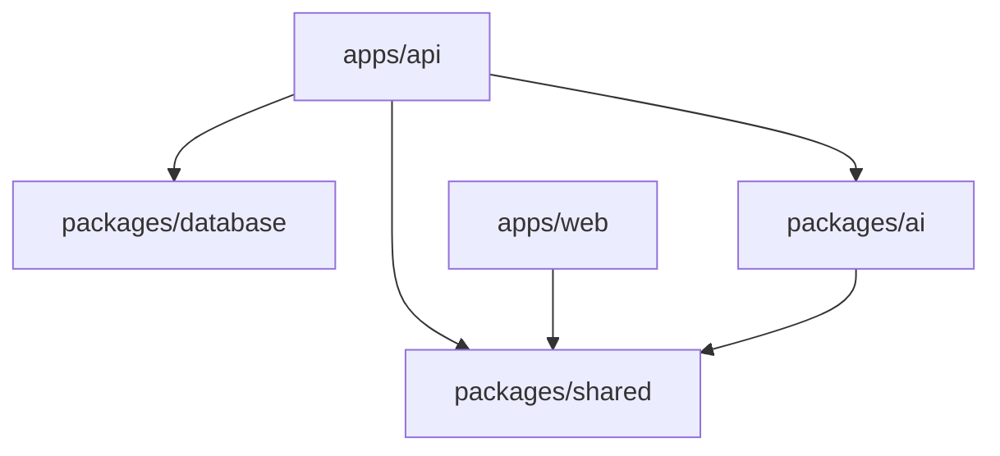

# Architecture Overview

**Last Updated:** January 2026
**Version:** 1.0.0
**Target Audience:** Developers
**For detailed architecture:** See root `ARCHITECTURE.md`

---

## Table of Contents

1. [High-Level Overview](#high-level-overview)
2. [Monorepo Structure](#monorepo-structure)
3. [Module Boundaries](#module-boundaries)
4. [Backend Architecture (NestJS)](#backend-architecture-nestjs)
5. [Frontend Architecture (Next.js)](#frontend-architecture-nextjs)
6. [Database Design](#database-design)
7. [AI/LLM Integration](#aillm-integration)
8. [Key Patterns](#key-patterns)
9. [Data Flow Examples](#data-flow-examples)

---

## High-Level Overview

Sentinel RFP is a **monorepo application** using **Turborepo** for workspace orchestration. The architecture follows **Domain-Driven Design (DDD)** with clear bounded contexts.

```
┌─────────────────────────────────────────────────────────────────┐
│                     SENTINEL RFP ARCHITECTURE                    │
├─────────────────────────────────────────────────────────────────┤
│                                                                  │
│  ┌──────────────┐          ┌──────────────┐                    │
│  │   Frontend   │          │   Backend    │                    │
│  │  Next.js 14  │◄────────►│   NestJS     │                    │
│  │  (Port 3000) │   REST   │ (Port 3001)  │                    │
│  └──────────────┘          └───────┬──────┘                    │
│                                    │                             │
│                     ┌──────────────┴──────────────┐             │
│                     │                              │             │
│           ┌─────────▼─────────┐         ┌─────────▼─────────┐   │
│           │   PostgreSQL      │         │      Redis        │   │
│           │  + pgvector       │         │   Cache/Queues    │   │
│           │  (Port 5432)      │         │   (Port 6379)     │   │
│           └───────────────────┘         └───────────────────┘   │
│                                                                  │
│           ┌─────────────────────────────────────────┐           │
│           │          Meilisearch                    │           │
│           │       Full-text Search                  │           │
│           │         (Port 7700)                     │           │
│           └─────────────────────────────────────────┘           │
│                                                                  │
└─────────────────────────────────────────────────────────────────┘
```

### Core Components

| Component        | Technology                  | Purpose                         | Port |
| ---------------- | --------------------------- | ------------------------------- | ---- |
| **Frontend Web** | Next.js 14 App Router       | User interface, SSR             | 3000 |
| **Backend API**  | NestJS + TypeScript         | Business logic, APIs            | 3001 |
| **Database**     | PostgreSQL 16 + pgvector    | Data persistence, vector search | 5432 |
| **Cache/Queues** | Redis 7.x + BullMQ          | Caching, async jobs             | 6379 |
| **Search**       | Meilisearch                 | Full-text search                | 7700 |
| **AI/LLM**       | Anthropic Claude (external) | Response generation             | N/A  |

---

## Monorepo Structure

```
sentinel-rfp/
├── apps/
│   ├── api/                    # Backend NestJS application
│   │   └── src/
│   │       ├── identity/       # Auth, users, organizations (Bounded Context)
│   │       ├── proposal/       # Proposals, questions, responses (BC)
│   │       ├── knowledge/      # Documents, library (BC)
│   │       ├── dashboard/      # Dashboard metrics/stats
│   │       └── health/         # Health checks
│   │
│   └── web/                    # Frontend Next.js application
│       └── src/
│           ├── app/            # Next.js 14 App Router pages
│           ├── components/     # React components
│           ├── lib/            # Client utilities
│           └── hooks/          # React hooks
│
├── packages/
│   ├── database/               # Shared Prisma schema
│   │   └── prisma/
│   │       ├── schema.prisma   # Database models
│   │       ├── migrations/     # DB migrations
│   │       └── seed.ts         # Seed data
│   │
│   ├── ai/                     # AI/LLM abstraction layer
│   │   └── src/
│   │       ├── types/          # AI types
│   │       ├── providers/      # Anthropic, OpenAI providers
│   │       └── router/         # LLM routing logic
│   │
│   └── shared/                 # Common utilities
│       └── src/
│           ├── types/          # Shared TypeScript types
│           └── utils/          # Utility functions
│
├── docs/                       # Documentation
│   └── development/            # Developer-facing docs
│
└── scripts/                    # Automation scripts
```

### Workspace Dependencies



---

## Module Boundaries

Sentinel RFP follows **Domain-Driven Design** with clear bounded contexts:

### 1. Identity Context (`apps/api/src/identity/`)

**Responsibility:** Authentication, authorization, user/organization management

**Modules:**

- `auth/` - JWT authentication, registration, login, refresh tokens
- `organization/` - Multi-tenant organization CRUD
- `user/` - User profile management

**Database Models:**

- `User` - User accounts
- `Organization` - Tenant organizations
- `RefreshToken` - Token rotation
- `UserOrganization` - User-org relationships

**Key Pattern:** Multi-tenancy with organization-scoped queries

### 2. Proposal Context (`apps/api/src/proposal/`)

**Responsibility:** Proposal lifecycle management

**Modules:**

- `proposal/` - Proposal CRUD, status transitions
- (Future) `question/` - Question extraction, parsing
- (Future) `response/` - AI response generation

**Database Models:**

- `Proposal` - RFP proposal container
- `Section` - Proposal sections (hierarchical)
- `Question` - Extracted questions
- `Response` - AI-generated responses with trust scores

**Key Pattern:** Aggregate root (Proposal) with child entities

### 3. Knowledge Context (`apps/api/src/knowledge/`)

**Responsibility:** Document management, knowledge base

**Modules:**

- (Future) `document/` - Document upload, parsing
- (Future) `library/` - Knowledge library entries
- (Future) `chunk/` - Vector chunks for RAG

**Database Models:**

- `Document` - Uploaded documents
- `Chunk` - Semantic chunks with embeddings
- `LibraryEntry` - Curated knowledge entries

**Key Pattern:** Vector search with pgvector

### 4. Dashboard Context (`apps/api/src/dashboard/`)

**Responsibility:** Analytics, metrics, overview

**Modules:**

- `dashboard/` - Aggregate metrics, proposals list

**Key Pattern:** Read-only aggregated queries

---

## Backend Architecture (NestJS)

### Layered Architecture

```
┌────────────────────────────────────────────────┐
│              Controller Layer                   │
│  (HTTP, Validation, DTO Transformation)         │
└────────────┬───────────────────────────────────┘
             │
┌────────────▼───────────────────────────────────┐
│              Service Layer                      │
│  (Business Logic, Orchestration)                │
└────────────┬───────────────────────────────────┘
             │
┌────────────▼───────────────────────────────────┐
│             Repository Layer                    │
│  (Prisma Client, Database Access)               │
└────────────┬───────────────────────────────────┘
             │
┌────────────▼───────────────────────────────────┐
│            Database (PostgreSQL)                │
└────────────────────────────────────────────────┘
```

### Module Structure (Example: Proposal)

```
apps/api/src/proposal/
├── proposal.module.ts          # NestJS module definition
├── proposal.controller.ts      # HTTP endpoints (DTOs, validation)
├── proposal.service.ts         # Business logic
├── dto/
│   ├── create-proposal.dto.ts  # Input validation
│   ├── update-proposal.dto.ts
│   └── proposal-response.dto.ts # Output serialization
└── entities/
    └── proposal.entity.ts      # Domain entity (optional - using Prisma)
```

### Key NestJS Patterns

#### 1. Dependency Injection

```typescript
// proposal.service.ts
@Injectable()
export class ProposalService {
  constructor(
    private prisma: PrismaService,
    private tenantContext: TenantContextService,
  ) {}

  // Business logic methods
}
```

#### 2. Guards for Authorization

```typescript
// Example: JwtAuthGuard
@Controller('proposals')
@UseGuards(JwtAuthGuard) // Protect entire controller
export class ProposalController {
  @Get()
  async findAll() {
    // Only authenticated users reach here
  }
}
```

#### 3. Interceptors for Logging

```typescript
// Global interceptor in main.ts
app.useGlobalInterceptors(new LoggingInterceptor());
```

#### 4. Exception Filters

```typescript
// Global exception filter (RFC 7807 format)
app.useGlobalFilters(new HttpExceptionFilter());
```

### Middleware Stack

```
Request
  ↓
CORS Middleware
  ↓
Helmet Security
  ↓
Logging Interceptor
  ↓
JwtAuthGuard
  ↓
TenantContext Middleware (inject organizationId)
  ↓
Controller (validation)
  ↓
Service (business logic)
  ↓
Prisma Client (DB query with tenant filter)
  ↓
Response
```

---

## Frontend Architecture (Next.js)

### Next.js 14 App Router

```
apps/web/src/app/
├── (auth)/                     # Route group (auth layout)
│   ├── login/
│   │   └── page.tsx            # Login page
│   └── register/
│       └── page.tsx            # Register page
│
├── (dashboard)/                # Route group (dashboard layout)
│   ├── layout.tsx              # Dashboard layout (sidebar, header)
│   ├── page.tsx                # Dashboard home
│   ├── proposals/
│   │   ├── page.tsx            # Proposals list
│   │   ├── [id]/
│   │   │   └── page.tsx        # Proposal detail
│   │   └── new/
│   │       └── page.tsx        # Create proposal
│   └── library/
│       └── page.tsx            # Knowledge library
│
└── layout.tsx                  # Root layout
```

### State Management

| Type             | Tool                         | Use Case                      |
| ---------------- | ---------------------------- | ----------------------------- |
| **Server State** | TanStack Query (React Query) | API data fetching, caching    |
| **Client State** | Zustand                      | UI state, modals, preferences |
| **Form State**   | React Hook Form              | Form validation, submission   |
| **URL State**    | Next.js `useSearchParams`    | Filters, pagination           |

### Component Architecture

```
components/
├── ui/                         # Atomic design system (shadcn/ui)
│   ├── button.tsx
│   ├── input.tsx
│   ├── card.tsx
│   └── ...
│
├── features/                   # Feature-specific components
│   ├── auth/
│   │   ├── LoginForm.tsx
│   │   └── RegisterForm.tsx
│   ├── proposals/
│   │   ├── ProposalCard.tsx
│   │   ├── ProposalList.tsx
│   │   └── CreateProposalModal.tsx
│   └── dashboard/
│       ├── MetricsCard.tsx
│       └── RecentActivity.tsx
│
└── layouts/                    # Layout components
    ├── DashboardLayout.tsx
    └── AuthLayout.tsx
```

### Data Fetching Pattern

```typescript
// Example: Fetching proposals with React Query
'use client';

import { useQuery } from '@tanstack/react-query';
import { proposalsApi } from '@/lib/api';

export function ProposalsList() {
  const { data, isLoading, error } = useQuery({
    queryKey: ['proposals'],
    queryFn: proposalsApi.list,
  });

  if (isLoading) return <Skeleton />;
  if (error) return <ErrorState />;

  return <ProposalsTable data={data} />;
}
```

---

## Database Design

### Core Models

```prisma
// packages/database/prisma/schema.prisma

// Identity Context
model User {
  id            String   @id @default(cuid())
  email         String   @unique
  passwordHash  String
  organizations UserOrganization[]
  createdAt     DateTime @default(now())
  updatedAt     DateTime @updatedAt
}

model Organization {
  id        String   @id @default(cuid())
  name      String
  users     UserOrganization[]
  proposals Proposal[]
  createdAt DateTime @default(now())
  updatedAt DateTime @updatedAt
}

// Proposal Context
model Proposal {
  id             String   @id @default(cuid())
  title          String
  status         ProposalStatus
  organizationId String
  organization   Organization @relation(fields: [organizationId], references: [id])
  sections       Section[]
  createdAt      DateTime @default(now())
  updatedAt      DateTime @updatedAt

  @@index([organizationId])  // Multi-tenancy index
}

model Section {
  id         String   @id @default(cuid())
  title      String
  proposalId String
  proposal   Proposal @relation(fields: [proposalId], references: [id])
  questions  Question[]
}

model Question {
  id          String   @id @default(cuid())
  text        String
  sectionId   String
  section     Section  @relation(fields: [sectionId], references: [id])
  responses   Response[]
}

model Response {
  id          String   @id @default(cuid())
  content     String
  trustScore  Float
  questionId  String
  question    Question @relation(fields: [questionId], references: [id])
  citations   Citation[]
}
```

### Multi-Tenancy Strategy

**Global Prisma Middleware** enforces organization isolation:

```typescript
// Automatically inject organizationId filter
prisma.$use(async (params, next) => {
  const organizationId = tenantContext.getCurrentOrganizationId();

  if (params.model === 'Proposal') {
    params.args.where = {
      ...params.args.where,
      organizationId,
    };
  }

  return next(params);
});
```

### Vector Search (pgvector)

```prisma
model Chunk {
  id        String   @id @default(cuid())
  content   String
  embedding Unsupported("vector(1536)")  // OpenAI embedding dimension
  documentId String
  document  Document @relation(fields: [documentId], references: [id])

  @@map("chunks")
}
```

**Similarity Search Query:**

```typescript
// Find similar chunks using cosine similarity
const similarChunks = await prisma.$queryRaw`
  SELECT id, content, 1 - (embedding <=> ${queryEmbedding}::vector) AS similarity
  FROM chunks
  WHERE 1 - (embedding <=> ${queryEmbedding}::vector) > 0.7
  ORDER BY similarity DESC
  LIMIT 10
`;
```

---

## AI/LLM Integration

### Architecture

```
packages/ai/
├── src/
│   ├── types/
│   │   └── index.ts            # LLMRequest, LLMResponse, Provider
│   ├── providers/
│   │   ├── anthropic.ts        # Claude integration
│   │   ├── openai.ts           # GPT integration (future)
│   │   └── base.ts             # Abstract provider
│   └── router/
│       └── llm-router.ts       # Provider selection, fallback
```

### LLM Provider Interface

```typescript
// Abstract provider interface
export abstract class LLMProvider {
  abstract generate(request: LLMRequest): Promise<LLMResponse>;
  abstract streamGenerate(request: LLMRequest): AsyncGenerator<LLMChunk>;
  abstract embed(text: string): Promise<number[]>;
}

// Anthropic implementation
export class AnthropicProvider extends LLMProvider {
  private client: Anthropic;

  async generate(request: LLMRequest): Promise<LLMResponse> {
    const response = await this.client.messages.create({
      model: 'claude-opus-4-5-20251101',
      max_tokens: request.maxTokens,
      messages: request.messages,
    });

    return {
      content: response.content[0].text,
      usage: response.usage,
    };
  }
}
```

### LLM Router (Fallback Strategy)

```typescript
// packages/ai/src/router/llm-router.ts
export class LLMRouter {
  private providers: LLMProvider[];

  async generate(request: LLMRequest): Promise<LLMResponse> {
    for (const provider of this.providers) {
      try {
        return await provider.generate(request);
      } catch (error) {
        // Log failure, try next provider
        this.logger.warn(`Provider ${provider.name} failed, falling back`);
      }
    }

    throw new Error('All LLM providers failed');
  }
}
```

---

## Key Patterns

### 1. Repository Pattern (Implicit with Prisma)

Prisma acts as the repository layer. Services interact with Prisma Client:

```typescript
@Injectable()
export class ProposalService {
  constructor(private prisma: PrismaService) {}

  async findAll(organizationId: string) {
    return this.prisma.proposal.findMany({
      where: { organizationId },
      include: { sections: true },
    });
  }
}
```

### 2. DTO Pattern (Data Transfer Objects)

Separate input/output models from domain models:

```typescript
// Input DTO
export class CreateProposalDto {
  @IsString()
  @MinLength(3)
  title: string;

  @IsEnum(ProposalStatus)
  status: ProposalStatus;
}

// Output DTO
export class ProposalResponseDto {
  id: string;
  title: string;
  status: string;
  createdAt: Date;

  @Exclude()
  internalField: string; // Never exposed to API
}
```

### 3. Strategy Pattern (LLM Providers)

Different LLM providers implement the same interface:

```typescript
// Choose provider at runtime
const provider = config.primaryLLM === 'anthropic' ? new AnthropicProvider() : new OpenAIProvider();

const response = await provider.generate(request);
```

### 4. Observer Pattern (Events)

Use NestJS Events for decoupled communication:

```typescript
// Emit event
this.eventEmitter.emit('proposal.created', { proposalId });

// Listen for event (in different module)
@OnEvent('proposal.created')
async handleProposalCreated(payload: { proposalId: string }) {
  // Send notification, update analytics, etc.
}
```

---

## Data Flow Examples

### Example 1: Create Proposal

```
1. User submits form in Next.js
   └─> POST /api/v1/proposals

2. NestJS Controller
   └─> Validates CreateProposalDto
   └─> Extracts JWT (userId, organizationId)

3. ProposalService
   └─> Calls prisma.proposal.create({
       data: {
         title,
         status,
         organizationId,  // Multi-tenancy
       }
     })

4. Prisma Middleware
   └─> Auto-injects organizationId filter
   └─> Saves to PostgreSQL

5. Controller
   └─> Returns ProposalResponseDto (serialized)

6. Next.js
   └─> React Query cache invalidation
   └─> UI updates automatically
```

### Example 2: AI Response Generation

```
1. User clicks "Generate Response" for Question

2. Backend receives POST /proposals/:id/questions/:qid/generate

3. QuestionService
   └─> Retrieves question context
   └─> Searches knowledge base (RAG)
       └─> Generates embedding (OpenAI)
       └─> Queries pgvector for similar chunks
       └─> Ranks results by relevance

4. LLMRouter
   └─> Prepares prompt with context
   └─> Calls Anthropic Claude
   └─> Streams response chunks

5. ResponseService
   └─> Calculates trust score
   └─> Extracts citations
   └─> Saves Response entity

6. Frontend
   └─> Receives SSE stream
   └─> Updates UI in real-time
```

---

## Next Steps

- **Code Conventions:** See `code-conventions.md` for style guide
- **Database Details:** See `database.md` for schema deep dive
- **Testing Guide:** See `testing.md` for test patterns
- **Full Architecture:** See root `/ARCHITECTURE.md` for complete C4 diagrams

---

**Questions?** Check `troubleshooting.md` or create an issue on GitHub.
